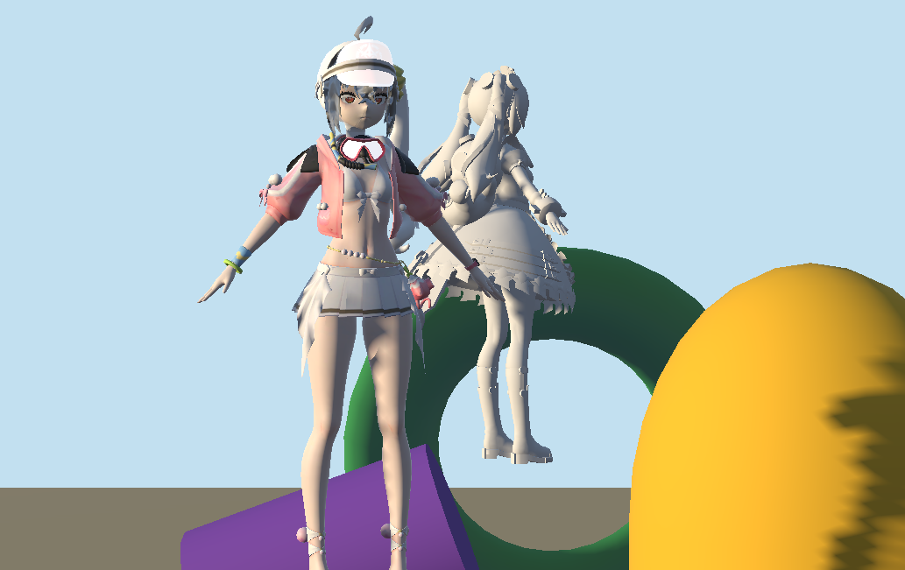
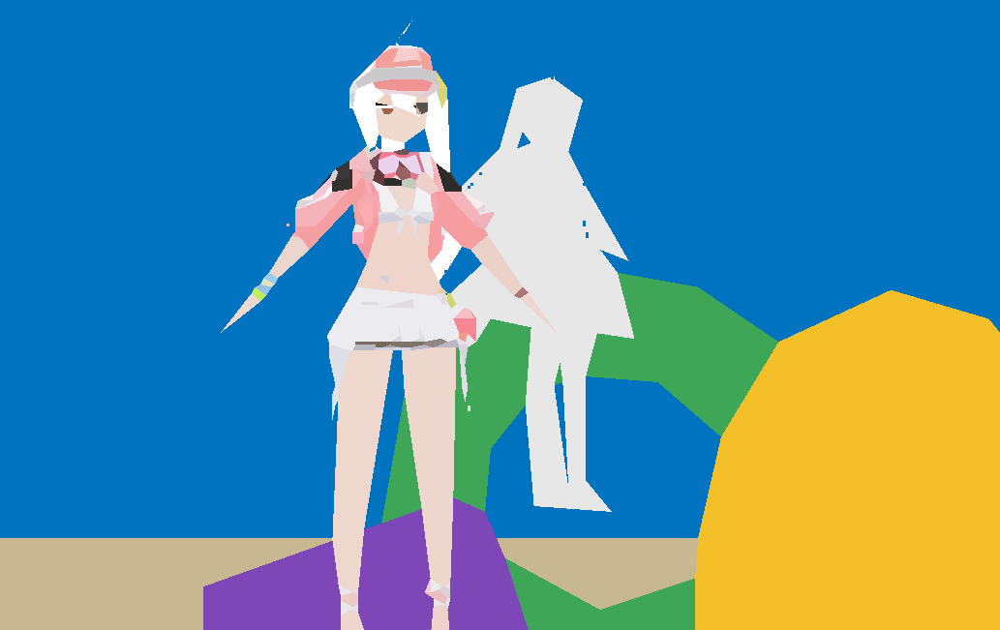

# Cartoon Renderer

A small real-time cartoon rendering test project made in Unity.

This project explores stylized character rendering through simplified lighting, color grouping, graphic shadow shapes, outlines, stylized materials, and post-processing. The main goal is to study how real-time 3D rendering can be pushed closer to the visual language of 2D animation and illustration.

[中文版本](#中文版)

---

## Overview

The current rendering experiments mainly focus on:

- Cel / Toon Shading
- Simplified light and shadow grouping
- Graphic color blocking
- Character outlines
- Controlled color ranges
- Stylized material response
- Post-processing
- Anime-inspired character presentation

The project is currently used as a visual testbed rather than a finished game.

## Rendering Goals

Instead of pursuing physically realistic materials, this project focuses on controlling how visual information is presented.

The renderer aims to reduce unnecessary lighting detail and reorganize the image into clearer graphic regions, allowing the final result to feel closer to 2D animation, illustration, and concept art.

### Shadow Simplification

Continuous lighting is reduced into a limited number of clear tonal regions.

The shape of the shadow is treated as part of the visual design rather than only as a physically accurate lighting result.

### Color Control

Material colors are adjusted to preserve a stable and readable palette under different lighting conditions.

The goal is to keep the character's local colors and overall color relationships consistent.

### Graphic Color Blocking

Large color areas are simplified and organized into clear shapes.

This helps reduce small surface details and creates a flatter, more illustration-like image.

### Outline Rendering

Outlines are used to strengthen silhouettes and improve readability against complex backgrounds.

Internal lines may also be introduced selectively to reinforce important forms.

### Stylized Materials

Materials are designed around the final visual result rather than strict physical accuracy.

Different surfaces can use different rendering logic, including:

- Skin
- Hair
- Cloth
- Metal
- Eyes
- Emissive / Unlit materials

### Post Processing

Post-processing is used to unify the final image and control:

- Contrast
- Color balance
- Tonal hierarchy
- Overall mood
- Final visual consistency

---

## Before / After

A comparison between the original Unity rendering and the current stylized rendering result.

| Before | After |
| --- | --- |
|  |  |

The current renderer simplifies continuous lighting into clear graphic regions and reduces unnecessary surface detail.

The goal is not to reproduce physically realistic lighting, but to control the visual hierarchy of the image and move the result closer to 2D animation and illustration.

---

## Status

🚧 **Work in Progress**

This repository currently contains rendering experiments and visual tests.

Shaders, materials, lighting setups, and post-processing settings may change frequently.

## Built With

- Unity
- Real-time shader rendering
- Toon / Cel Shading
- Post Processing
- Git LFS

## Future Experiments

Planned areas of exploration include:

- More stable face shading
- Better hair shading
- Improved shadow shape control
- Directional face lighting
- More consistent outline behavior
- Material-specific toon shading
- Emissive / Unlit material experiments
- More consistent rendering across different environments
- Character-focused lighting setups
- More illustration-like shadow design

## Author

**UratomClanys**

Concept Art / Character Design / Stylized Rendering

## License

This project is currently intended for personal research and portfolio use.

Unless otherwise stated, original project assets should not be redistributed or used commercially without permission.

---

# 中文版

这是一个使用 Unity 制作的实时卡通渲染测试项目。

项目主要用于研究风格化角色渲染，包括光影归纳、颜色控制、图形化色块、描边、材质表现以及后期处理等内容。

项目的目标并不是追求物理真实感，而是尝试让实时 3D 画面更加接近二维动画、插画以及角色原画中的视觉表现。

---

## 项目简介

目前的渲染实验主要包含：

- Cel / Toon Shading 卡通渲染
- 光影归纳
- 图形化色块
- 角色轮廓描边
- 色彩范围控制
- 风格化材质表现
- 后期处理
- 动漫 / 插画风角色表现

目前该项目主要作为一个视觉测试场使用，并不是完整的游戏项目。

## 渲染目标

这个项目并不以 PBR 或真实材质表现为主要目标，而是更关注如何控制画面中的视觉信息。

通过减少不必要的光照细节，将阴影、颜色以及材质表现归纳为更加明确的图形区域，使最终画面更接近二维动画、插画和概念设计中的视觉语言。

### 光影归纳

将连续的真实光照简化为数量有限、边界明确的明暗区域。

相比传统写实渲染，更强调阴影形状本身对于角色结构和画面设计的作用。

### 色彩控制

控制材质在不同光照环境下的颜色变化，使角色能够保持相对稳定的固有色和整体色彩关系。

### 图形化色块

将复杂的表面明暗进一步压缩为较大的色彩区域。

通过减少细碎的材质信息，让画面呈现更明确的平面构成和插画感。

### 轮廓描边

通过轮廓线强化角色剪影，并提高角色在复杂背景中的可读性。

同时尝试选择性地保留部分内部结构线，使模型呈现更接近二维绘画的视觉效果。

### 风格化材质

材质设计以最终画面效果为优先，而不是完全遵循真实世界中的物理材质属性。

不同部位可以使用不同的光照逻辑，例如：

- 皮肤
- 头发
- 布料
- 金属
- 眼睛
- 发光 / Unlit 材质

### 后期处理

通过后期处理进一步统一画面，包括：

- 对比度控制
- 色彩调整
- 明暗关系
- 画面整体色调
- 最终视觉统一

---

## Before / After 对比

普通 Unity 渲染与当前卡通渲染效果的对比。

| Before / 原始渲染 | After / 卡通渲染 |
| --- | --- |
|  |  |

目前的渲染方式会将连续的光照关系进一步归纳成明确的色块，并减少模型表面不必要的明暗细节。

目标并不是模拟真实世界中的光照，而是主动控制画面的视觉层级，使最终效果更加接近二维动画与插画。

---

## 当前状态

🚧 **开发 / 测试中**

目前仓库主要包含渲染实验和视觉测试内容。

Shader、材质、灯光配置以及后期处理参数都可能随着测试持续调整。

## 使用技术

- Unity
- 实时 Shader 渲染
- Toon / Cel Shading
- Post Processing
- Git LFS

## 后续实验方向

计划继续研究：

- 更稳定的角色面部阴影
- 头发明暗归纳
- 更可控的阴影形状
- 面部定向光照
- 更自然的轮廓线表现
- 不同材质对应不同 Toon Shader
- Emissive / Unlit 材质表现
- 不同环境光照下保持稳定的角色颜色
- 面向角色展示的灯光系统
- 更接近动画原画的阴影形状控制

## 作者

**UratomClanys**

Concept Art / Character Design / Stylized Rendering

概念设计 / 角色设计 / 风格化渲染

## 许可

目前该项目主要用于个人研究以及作品集展示。

除非另有说明，项目中的原创资源不允许在未经许可的情况下重新分发或用于商业用途。
